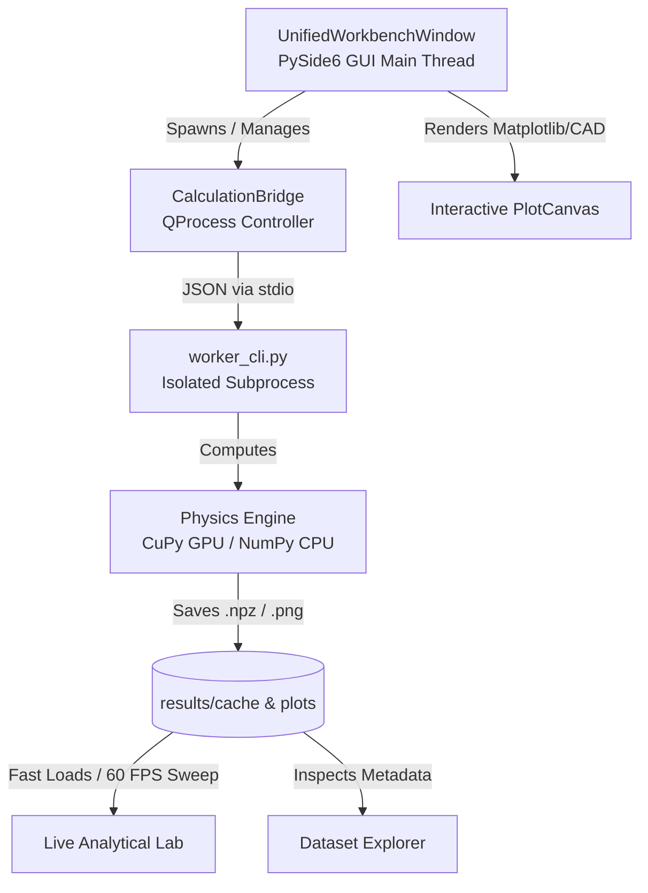

# Architecture & Codebase Map: Many-Body Studio Pro

> **Purpose**: Single-source-of-truth architectural guide for developers and AI agents to understand the repository structure, IPC design, and core invariants without scanning every source file.

---

## 1. High-Level System Architecture



Many-Body Studio Pro is an asynchronous, high-performance desktop workbench for correlated electron physics in metal-Mott insulator heterostructures.

---

## 2. Directory & Component Blueprint

```
masters_thesis_gui/
├── run_studio.py                  # Direct Python launcher script
├── run_studio.bat                 # Windows batch launcher (forces UTF-8 console)
├── ARCHITECTURE.md                # System map and agent reference (this file)
├── README.md                      # General user overview and quickstart
│
├── pyside6_studio/                # Main Application Package
│   ├── main_window.py             # Main QMainWindow shell, toolbars, docks, perspectives
│   ├── theme.py                   # Centralized QSS stylesheets (Light/Dark), color tokens
│   │
│   ├── backend/                   # Subprocess Execution & Communication Layer
│   │   ├── bridge.py              # CalculationBridge: QProcess supervisor, JSON stream parser, kill logic
│   │   └── worker_cli.py          # Standalone CLI worker executing heavy physics calculations
│   │
│   ├── core/                      # Non-UI Domain Logic & Engines
│   │   ├── hardware.py            # Hardware diagnostics, CuPy CUDA VRAM & CPU core detection
│   │   ├── presets.py             # Grid resolution presets (Draft 64x64, Standard 100x100, Pub 256x256)
│   │   └── cache_manager.py       # Parameter hashing, 1/8th IBZ bit-groomed Sigma cache detection
│   │
│   ├── resources/                 # Embedded Assets
│   │   └── icons/                 # Dynamic vector & PNG UI icons
│   │
│   └── widgets/                   # Reusable UI Viewports & Workbenches
│       ├── plot_canvas.py         # High-DPI QGraphicsView canvas (zoom, pan, coordinate tracker)
│       ├── gallery_browser.py     # Left visual thumbnail & compact list gallery browser
│       ├── dataset_explorer.py    # Left dock dataset tree scanner with metadata inspection
│       ├── data_plotter.py        # Custom slice & data curve plotting dialog
│       ├── live_analytical_lab.py # Central Pillar: 60 FPS real-time J_K coupler & live analysis
│       └── analytical_modes/      # Plug-in Analytical Modes
│           ├── dos_fermi_surface_mode.py # Real-time DOS and Fermi Surface viewer
│           ├── dynamic_susceptibility_mode.py # Dynamic chi(q, omega) frequency & q-path slicer
│           └── rpa_susceptibility_mode.py     # Static chi(q) 2D/3D RPA susceptibility
│
├── tests/                         # Automated Headless Test Suite (unittest standard)
│   ├── __init__.py                # Headless offscreen config (QT_QPA_PLATFORM=offscreen)
│   ├── helpers.py                 # Test harness: SignalCollector, process_events, process inspector
│   ├── test_v35_three_pillars.py  # 3 Core Pillars: Live Lab, Publication Studio, Caching Engine
│   ├── test_all_four_solvers.py   # Parameter plumbing & execution across all 4 physics studies
│   ├── test_caching_and_directory_engine.py # Cache hashing, bypass, and directory routing
│   ├── test_dataset_explorer.py   # Dataset tree scanner & metadata card extraction
│   ├── test_e2e_tier1.py          # Tier 1: Window geometry, dock sizing, perspective & theme toggle
│   ├── test_e2e_tier2.py          # Tier 2: Canvas rendering, zoom/pan, and comparative split view
│   ├── test_e2e_tier3.py          # Tier 3: Parameter validation, presets, and solver selection
│   └── test_e2e_tier4.py          # Tier 4: Process tree cancellation, sub-second hard kill, VRAM purge
│
└── results/                       # Local Calculation Outputs (gitignored)
    ├── cache/                     # Precomputed .npz arrays (Sigma, bare chi0, bisection arrays)
    ├── plots/                     # Output figures (.png, .pdf)
    └── data/                      # Output sweep datasets (.npz)
```

---

## 3. Core Architectural Principles & Invariants

### 1. Asynchronous Process Isolation (Main Thread Safety)
- **Rule**: Heavy numerical routines (FFT, CuPy GPU operations, bisection loops) **must never** run on the Qt UI thread.
- **Implementation**: `CalculationBridge` launches `pyside6_studio.backend.worker_cli` via `QProcess`.
- **Communication Protocol**: Output is streamed line-by-line via stdout formatted as JSON:
  - `{"type": "progress", "percent": 45, "step": "Computing Bare Bubble"}`
  - `{"type": "status", "message": "Loaded point Base Sigma from cache"}`
  - `{"type": "result", "plot_path": "...", "data_path": "..."}`
  - `{"type": "error", "message": "..."}`

### 2. Two-Perspective Workspace System
The UI provides two specialized workflow modes controlled via `set_perspective(mode)`:
- **`"simulation"` (Simulation Studio)**: Parameter Inspector (Right Dock), Study Navigator (Left Dock), Run/Cancel Toolbar, and Live Process Console (Bottom Dock).
- **`"publication"` (Publication Figure Studio)**: Multi-Panel Subplot Layout, Figure Styling, Typography controls, and LaTeX `\begin{figure}` code generator.

### 3. UI Geometry & Dock Constraints
- **Left Dock (`dock_nav`)**: Fixed width of **$260\text{ px}$**.
- **Right Dock (`dock_inspector`)**: Fixed width of **$350\text{ px}$**.
- **Bottom Dock (`dock_bottom`)**: Auto-collapses/expands between **$140\text{ px}$** and batch queue height.

### 4. Color & Styling Tokens (`theme.py`)
- All visual styles are defined globally in `LIGHT_THEME_QSS` and `DARK_THEME_QSS`.
- **Run Button (`#BtnRun`)**: IDE Emerald Green (`#16a34a` Light / `#059669` Dark).
- **Cancel Button (`#BtnCancel`)**: Vivid Red (`#ef4444`) when active/running; subtle slate grey (`#f1f5f9` / `#1e293b`) when idle.
- **Mode Switcher (`#ModeSegmentedContainer`)**: Integrated dual-pill capsule.

---

## 4. Developer & Agent Commands

### Run Application
```powershell
# Windows PowerShell
.venv\Scripts\python.exe run_studio.py
```

### Run Automated Headless Tests
```powershell
# Run entire test suite (37 tests)
.venv\Scripts\python.exe -m unittest discover tests

# Run fast 3-Pillars test suite
.venv\Scripts\python.exe tests/test_v35_three_pillars.py

# Run isolated solver verification
.venv\Scripts\python.exe tests/test_all_four_solvers.py
```
