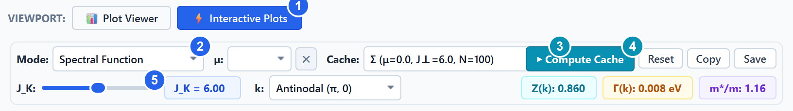
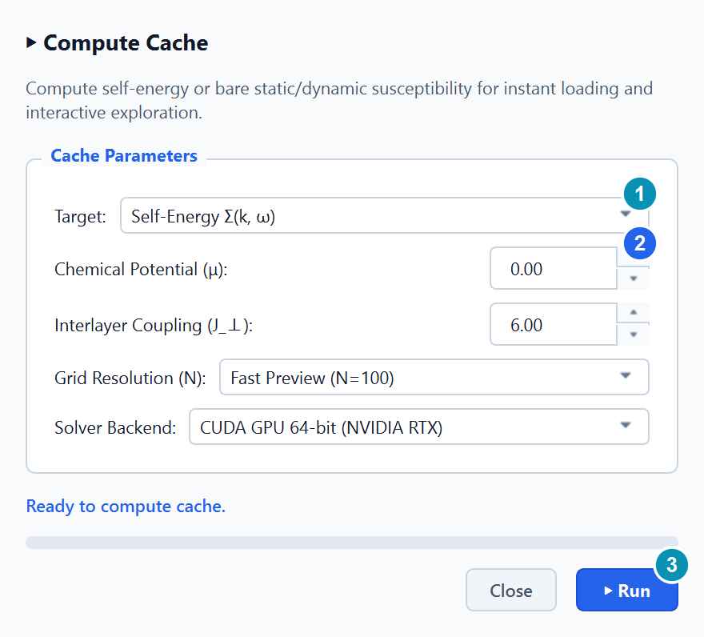
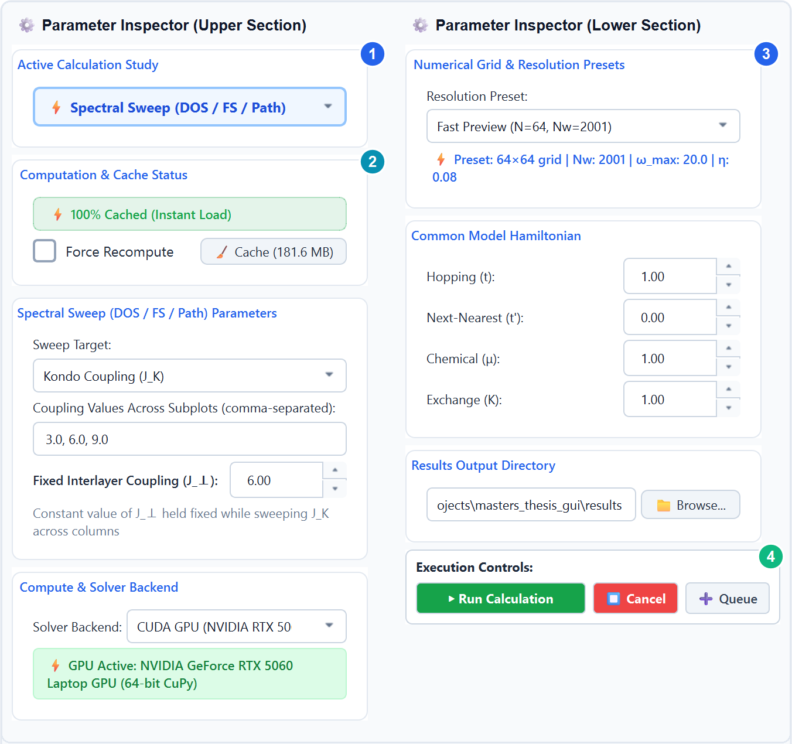
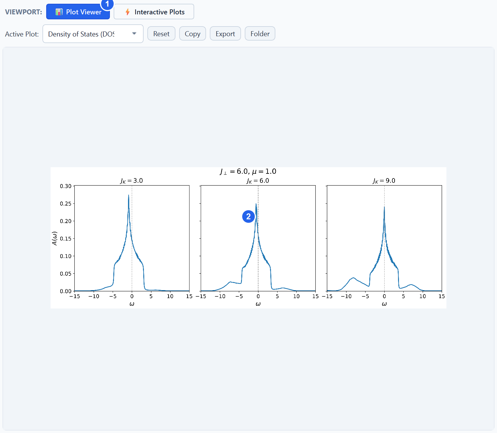
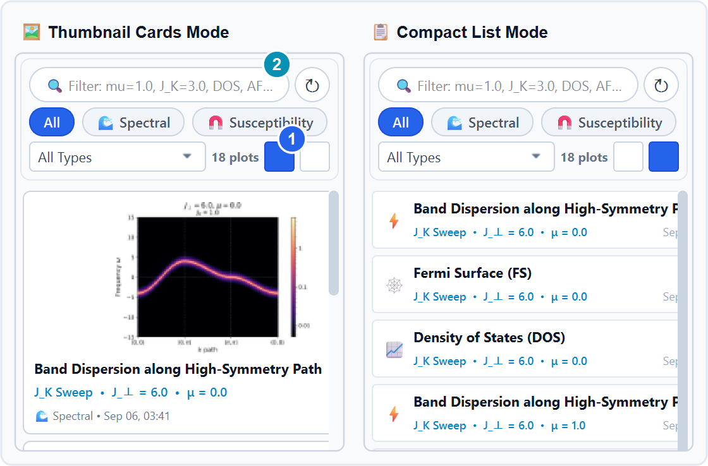

# 🚀 Many-Body Studio Pro: User & Feature Guide

A visual, 2–5 minute practical guide to navigating **Many-Body Studio Pro**. Rather than a rigid sequence, this guide is divided into three focused sections:

1. [Section 1: ⚡ Interactive Plots Viewport](#section-1--interactive-plots-viewport)
2. [Section 2: ⚙️ Right Panel (Parameter Inspector & Job Execution)](#section-2-️-right-panel-parameter-inspector--job-execution)
3. [Section 3: 📊 Plot Viewer Viewport & Left Panel](#section-3--plot-viewer-viewport--left-panel)

---

## Workspace Architecture Overview
* **Global Workspace**:
  * `[ 🔬 Simulation Studio ]`: Full numerical physics modeling, batch queueing, and dataset generation.
* **Central Viewports** (Center Header Bar):
  * `[ 📊 Plot Viewer ]`: High-DPI zoomable plot canvas with split-view comparison and direct PNG export.
  * `[ ⚡ Interactive Plots ]`: Instant 60 FPS analytical scaling, k-probing, and real-time sliders.

---

## Section 1: ⚡ Interactive Plots Viewport
Switch to this viewport by clicking **`[ ⚡ Interactive Plots ]`** on the central header bar.

*Figure 1.1: The Interactive Plots control strip with Viewport switcher.*
* **① Viewport Switcher**: Toggle to `[ ⚡ Interactive Plots ]` (highlighted in blue).
* **② Mode Selector**: Choose from 6 analytical experiment modes.
* **③ Cache Selector**: Select an existing pre-computed foundation array (filter by chemical potential $\mu$).
* **④ ▶ Compute Cache**: Open the direct dialog if no cache exists or if you need a new regime.
* **⑤ Continuous $J_K$ Slider**: Drag to scale the Kondo coupling continuously at 60 FPS.

---

### 1.1 Mode Selection
Select an analytical mode from the **Mode** dropdown:
1. **Brillouin Zone $k$-Probe**: Click or drag anywhere in $[-\pi, \pi]^2$ to evaluate spectral function $A(\mathbf{k}, \omega)$, $\text{Re}\,\Sigma$, and $\text{Im}\,\Sigma$ in $<1\text{ ms}$.
2. **Fermi Surface & Energy Slice**: Dynamically sweep energy $\omega$ to watch Fermi surface warping and gap openings.
3. **Band Dispersion**: Track quasiparticle dispersions along high-symmetry paths ($\Gamma \to X \to M \to \Gamma$).
4. **Static RPA Susceptibility**: 2D momentum map of bare and RPA-enhanced magnetic susceptibility $\chi(\mathbf{q})$.
5. **Dynamic Susceptibility**: Frequency-dependent magnetic response $\chi(\mathbf{q}, \omega)$.
6. **Electrical Conductivity**: Real-time optical and DC conductivity $\sigma(\omega)$.

---

### 1.2 Foundation Cache & The "▶ Compute Cache" Dialog
The real-time engine requires a pre-computed base array (`results/cache/`). If none is loaded, click the blue **`▶ Compute Cache`** button:

  

*Figure 1.2: In-situ Compute Cache dialog.*
* **① Target Selector**: Choose what foundation array to compute:
  * *Self-Energy $\Sigma(\mathbf{k}, \omega)$* (1-loop + 3-loop FFT convolutions)
  * *Bare Static Susceptibility $\chi_0(\mathbf{q})$*
  * *Bare Dynamic Susceptibility $\chi_0(\mathbf{q}, \omega)$*
* **② Cache Parameters**: Set chemical potential $\mu$, interlayer coupling $J_\perp$, and grid resolution $N$.
* **③ Compute Cache Button**: Starts the calculation immediately in the background (~0.3–2s on GPU) and auto-loads into the interactive canvas upon completion.

---

### 1.3 Mode-Specific Sliders & Real-Time Controls
Row 2 adapts dynamically based on the active mode:
* **Universal Coupling ($J_K$)**: A continuous slider ($0.5$ to $12.0\text{ eV}$) with 60 FPS analytical scaling.
* **$k$-Probe Controls**: Select standard high-symmetry points (`Antinodal`, `Nodal`, `Center Γ`, `Corner M`, `Custom`) or click directly on the 2D map.
* **Energy Slice ($\\omega$) Slider**: Available in Fermi Surface mode; sweeps slice energy from $-2.0\text{ eV}$ to $+2.0\text{ eV}$.
* **Susceptibility ($J_\perp$) Slider & $K$ Selector**: Available in RPA Susceptibility modes; controls interlayer coupling ($4.01 - 12.00\text{ eV}$) and exchange channel ($+1$ AFM vs. $-1$ FM).
* **Electrical Conductivity Device**: Switch between `Auto`, `GPU (CUDA)`, or `CPU (Multi-core)`.

---

## Section 2: ⚙️ Right Panel (Parameter Inspector & Job Execution)
The Right Dock is split into two balanced halves to present all cards without excessive vertical scrolling:

*Figure 2.1: The Parameter Inspector & Execution cards (divided side-by-side).*
* **① Active Study Selector**: Choose which physics study to configure.
* **② Cache Status Badge**: Real-time detection of pre-computed results (`🟢 Cached` vs `🟡 Uncached`) & Force Recompute.
* **③ Grid & Resolution Presets**: Choose between speed and publication-grade resolution.
* **④ Execution Controls**: `▶ Run Calculation` (green), `⏹ Cancel` (red), and `➕ Queue`.

---

### 2.1 Inspector Cards Overview
* **Part 1 (Left Column — Physics Study & Backend)**:
  * **Active Calculation Study**: Select solver (Spectral Sweep, Quasiparticle Spectral, Phase Diagram, RPA Susceptibility).
  * **Computation & Cache Status**: Real-time cache badge, *Force Recompute* checkbox, and *Cache Manager* button (`🧹 Cache (X MB)`).
  * **Study-Specific Parameters**: Sweep targets ($J_K$ vs. $J_\perp$), comma-separated values, fixed coupling, and panel layouts.
  * **Compute & Solver Backend**: Switch between *CUDA GPU (RTX 5060 64-bit CuPy)* and *CPU 64-bit* with core throttling ($50\% - 100\%$).
* **Part 2 (Right Column — Grid Presets & Execution)**:
  * **Numerical Grid & Presets**: Fast Preview ($64\times 64$), Standard ($100\times 100$), High-Res Production ($256\times 256$), or Custom Grid.
  * **Common Model Hamiltonian**: Set hopping $t$, next-nearest hopping $t'$, chemical potential $\mu$, and exchange $K$.
  * **Results Output Directory**: Destination folder for plots, caches, and datasets.
  * **Execution Controls**:
    * **`▶ Run Calculation`** (Emerald Green): Dispatches to background child process without freezing GUI.
    * **`⏹ Cancel / Stop`** (Vivid Red): Immediately terminates the calculation.
    * **`➕ Add Active to Queue`**: Enqueues parameter runs for sequential unattended processing.

---

## Section 3: 📊 Plot Viewer Viewport & Left Panel
Switch to this viewport by clicking **`[ 📊 Plot Viewer ]`** on the central header bar.

*Figure 3.1: Central high-DPI plot canvas.*
* **① Viewport Switcher**: Toggle to `[ 📊 Plot Viewer ]`.
* **② High-DPI Canvas**: Interactive zoom, pan, and coordinate tracking.

---

### 3.1 Central Plot Viewer Canvas
* **Smooth Zooming**: Use the **Mouse Scroll Wheel** anywhere on the canvas to zoom in/out on sharp spectral peaks.
* **Panning**: Click and drag with the **Left Mouse Button** to pan across momentum or frequency ranges.
* **🔍 Fit Window**: Click the toolbar button to reset zoom and center the figure.
* **⚏ Split View (Compare)**: Compare two calculation runs side-by-side.
* **Exporting Figures**: Right-click or use toolbar to copy to clipboard (300 DPI) or save or copy the currently displayed publication PNG.

---

### 3.2 Left Dock: Plot Gallery Browser
The Left Dock ($260\text{ px}$) provides a browser for all computed runs in the output directory:

*Figure 3.2: Left Gallery in Thumbnail Card Mode (left) and Compact List Mode (right).*
* **① View Mode Toggle**:
  * **🖼️ Thumbnail Card Mode**: Displays visual preview cards with observable titles, parameter chips, and timestamps.
  * **📋 Compact List Mode**: Dense row layout optimized for scanning through dozens of simulation runs quickly.
* **② Category Pills & Search**:
  * Quick filter pills: `All`, `🌊 Spectral`, `🧲 Susceptibility`, `⚡ Conductivity`.
  * Instant search bar matches parameters (e.g., typing `mu=1.0` or `JK=6.0` filters immediately).

---

### 3.3 Output Directory Structure (`results/`)
All generated simulation files are organized deterministically under the `results/` folder:
* **`results/cache/`**: Pre-computed, bit-groomed 1/8th IBZ foundation arrays (`sigma_base_*.npz`, `chi0_static_*.npz`, `chi0_dynamic_*.npz`).
* **`results/plots/`**: High-resolution publication-ready figures (`.png`, `.pdf`, `.svg`).
* **`results/data/`**: Full raw numerical NumPy datasets (`.npz`) for custom analysis.

## Current Architecture Notes

The left Navigator switches between the **Plot Gallery Browser** and **Interactive Modes**. The Plot Gallery Browser works with rendered PNG publication figures under `results/plots/`; the Interactive Plots viewport works from numerical `.npz` datasets and reusable caches.

The queue UI is implemented by `widgets/job_queue.py`, while process execution and cancellation remain owned by `CalculationBridge` and the main-window orchestration. Study parameter forms are separated under `widgets/study_forms/`.

The legacy Data Plotter/Figure Composer path has been removed. Generated `docs/HOW_TO_USE.html` is a derived artifact and is intentionally not updated by the debloat pass.
